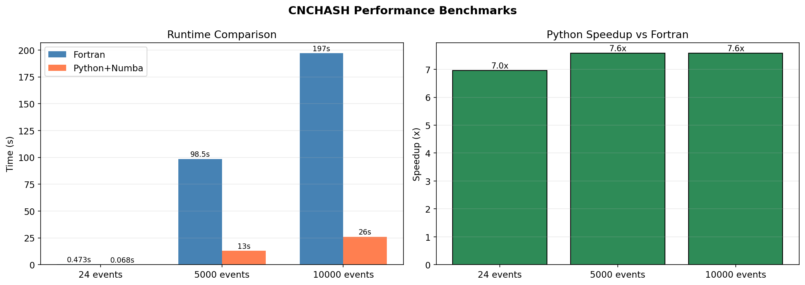
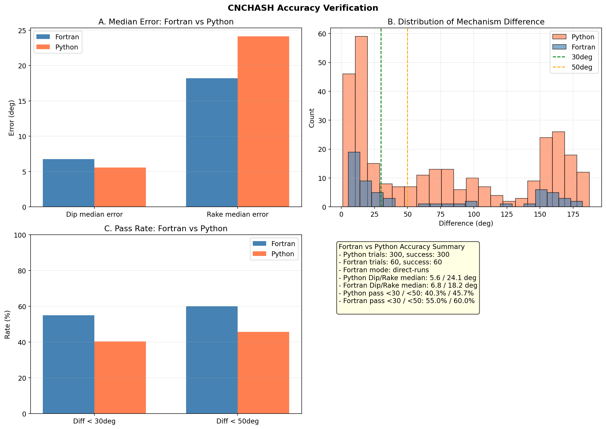

# CNCHASH

High-performance implementation of HASH for earthquake focal-mechanism
determination from P-wave polarities, built on a **Modern Fortran/OpenMP
native backend** with a clean Python front-end.


All computation runs in the Modern Fortran/OpenMP core (`libhashhp`): grid
search, S/P amplitudes, uncertainty analysis, and velocity tables. The
Python layer handles data, file formats, and the API. OpenMP threads and
event-level batch parallelism scale across cores.



## Performance

| Metric | Python+Numba | Fortran | Speedup |
|--------|-------------|---------|---------|
| 24 events | 0.068s | 0.473s | **6.9x** |
| Per event | 2.85ms | 19.7ms | **6.9x** |
| 5000 events | 13.0s | 98.5s | **7.6x** |
| 10000 events | 26.0s | 197.0s | **7.6x** |

Native backend scaling (30 stations, 30 MC trials, see
[docs/benchmarks.md](docs/benchmarks.md)):

| Threads | 1 | 2 | 4 | 8 | 16 |
|---------|---|---|---|---|----|
| Speedup | 1.0x | 1.8x | 3.0x | 4.1x | 6.1x |

## Accuracy Verification



**Key Results:**
- CNCHASH dip error median: 5.6°
- CNCHASH rake error median: 24.1°
- CNCHASH synthetic trials: 300/300 successful solutions
- HASH v1.2 synthetic trials: 60/60 successful solutions (direct-runs)

**Note:** Strike differences (40-80°) are normal - focal mechanisms have two orthogonal nodal planes that both satisfy polarity data.

## Quick Start

```bash
pip install cnchash
```

### Basic Usage (P-wave polarities only)

```python
from cnchash import run_hash
import numpy as np

# Azimuths, takeoff angles, polarities, quality
p_azi = np.array([45.0, 135.0, 225.0, 315.0])
p_the = np.array([30.0, 45.0, 60.0, 75.0])
p_pol = np.array([1, -1, 1, -1])  # 1=up, -1=down
p_qual = np.array([0, 0, 0, 0])

result = run_hash(p_azi, p_the, p_pol, p_qual)

print(f"Strike: {result['strike_avg']:.1f}")
print(f"Dip: {result['dip_avg']:.1f}")
print(f"Rake: {result['rake_avg']:.1f}")
print(f"Quality: {result['quality']}")
```

### With S/P Amplitude Ratio

```python
from cnchash import run_hash_with_amp
import numpy as np

# Same inputs as above, plus S/P amplitude ratios (log10 scale)
# sp_amp = 0.0 means no amplitude data for that station
sp_amp = np.array([0.3, -0.2, 0.5, 0.0])  # log10(S/P), 0.0 = no data

result = run_hash_with_amp(p_azi, p_the, p_pol, sp_amp)

print(f"Strike: {result['strike_avg']:.1f}")
print(f"Dip: {result['dip_avg']:.1f}")
print(f"Rake: {result['rake_avg']:.1f}")
print(f"Quality: {result['quality']}")
print(f"Polarity misfit: {result['mfrac']*100:.1f}%")
print(f"Amplitude misfit: {result['mavg']:.2f}")
```

## Backend Selection

```python
from cnchash import run_hash, run_hash_batch, available_backends, get_backend_info

# backend="auto" (default) uses the native backend when available
result = run_hash(p_azi, p_the, p_pol, p_qual, backend="auto", num_threads=16)

# Batch mode: many events in one native call (event-level OpenMP)
results = run_hash_batch(events, backend="fortran", num_threads=16)

print(available_backends())   # ['fortran']
print(get_backend_info())
```

See [docs/native_backend.md](docs/native_backend.md) for the backend
architecture, build instructions, and design rules.

## Features

- Grid search for focal mechanism determination
- Monte Carlo uncertainty analysis
- S/P amplitude ratio constraint
- Quality rating (A-D, E, F)
- Multiple phase file formats
- Modern Fortran/OpenMP native backend
- Event-level batch parallelism
- Core algorithm matches the original HASH v1.2 (golden-reference tested)

## Documentation

See https://cnchash.readthedocs.io/ for full documentation including:
- API reference
- Algorithm details
- File format specifications
- Performance optimization

## Run Tests

```bash
pytest tests/          # parity, determinism, batch, velocity suites
jupyter notebook HASH_Tests.ipynb
```

## Project Structure

```
cnchash/
├── backend/       # native backend binding (fortran via ctypes)
├── driver.py      # Main driver (run_hash, run_hash_batch)
├── io.py          # File I/O
└── utils.py       # Utilities

src/hash_hp/       # Modern Fortran/OpenMP core (libhashhp)
HASH_complete/     # Original Fortran HASH v1.2 (immutable golden reference)
benchmarks/        # performance benchmark suite
tests/             # parity, determinism, batch, velocity tests
```

## Author

He XingChen

## License

BSD 3-Clause

## References

Hardebeck, Jeanne L. and Peter M. Shearer, A new method for determining first-motion
focal mechanisms, Bulletin of the Seismological Society of America, 92,
2264-2276, 2002.

Hardebeck, Jeanne L. and Peter M. Shearer, Using S/P Amplitude Ratios to
Constrain the Focal Mechanisms of Small Earthquakes, Bulletin of the
Seismological Society of America, 93, 2434-2444, 2003.
