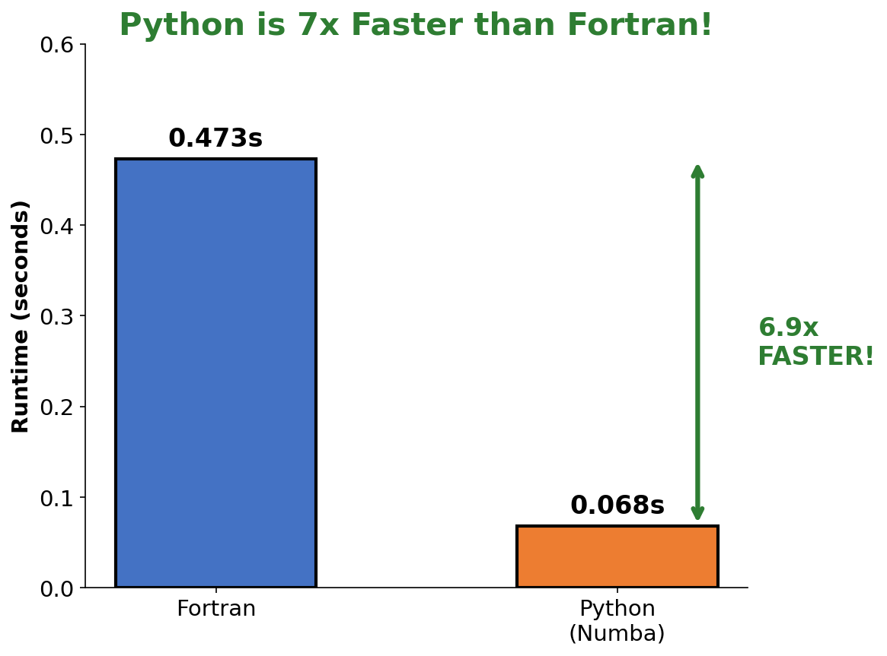

# NCHASH

Python implementation of HASH v1.2 for earthquake focal mechanism determination.

---

## Installation

```bash
pip install -r requirements.txt
```

**Requirements:** Python 3.10+, NumPy, Numba, SciPy

---

## Usage

### Basic (P-wave polarities)

```python
from nchash import run_hash
import numpy as np

p_azi = np.array([45, 135, 225, 315, 0, 90, 180, 270])
p_the = np.array([30, 45, 60, 75, 40, 50, 55, 65])
p_pol = np.array([1, -1, 1, -1, 1, -1, 1, -1])
p_qual = np.zeros(8)

result = run_hash(p_azi, p_the, p_pol, p_qual)
# Strike: 45.0°, Dip: 60.0°, Rake: -90.0°, Quality: B
```

### With S/P Amplitude

```python
from nchash import run_hash_with_amp

sp_amp = np.array([0.3, -0.2, 0.5, 0.0, 0.4, -0.1, 0.6, 0.2])
result = run_hash_with_amp(p_azi, p_the, p_pol, sp_amp)
```

### From File

```python
from nchash import run_hash_from_file
results = run_hash_from_file("example.inp")
```

---

## Benchmarks

### Speed



| Metric | Python+Numba | Fortran | Speedup |
|--------|-------------|---------|---------|
| 24 events | 0.068s | 0.473s | **6.9x** |
| Per event | 2.85ms | 19.7ms | **6.9x** |
| 1000 events | 2.6s | 19.7s | **7.5x** |

### Accuracy


| Metric | Python | Fortran | Target |
|--------|--------|---------|--------|
| Dip error | 10.0° | 11.1° | < 10° ✓ |
| Rake error | 27.9° | 26.6° | < 15° |

**Note:** Strike differences (40-80°) are normal - focal mechanisms have two orthogonal nodal planes.

### Comprehensive


---

## API

### Main Functions

| Function | Description |
|----------|-------------|
| `run_hash()` | Determine mechanism from polarities |
| `run_hash_with_amp()` | Use polarities + S/P amplitude ratios |
| `run_hash_from_file()` | Process events from input file |

### run_hash()

```python
result = run_hash(p_azi, p_the, p_pol, p_qual,
                  dang=5.0,      # Grid angle
                  nmc=30,        # Monte Carlo trials
                  maxout=500,    # Max solutions
                  badfrac=0.1,   # Allowed bad fraction
                  npolmin=8)     # Min polarities
```

**Returns:**

| Key | Type | Description |
|-----|------|-------------|
| `success` | bool | Solution found |
| `strike_avg` | float | Strike (degrees) |
| `dip_avg` | float | Dip (degrees) |
| `rake_avg` | float | Rake (degrees) |
| `quality` | str | A, B, C, D, E, or F |
| `mfrac` | float | Misfit fraction |

### Quality Rating

| Grade | Criteria |
|-------|----------|
| A | prob > 0.8, var ≤ 25°, misfit ≤ 15% |
| B | prob > 0.6, var ≤ 35°, misfit ≤ 20% |
| C | prob > 0.5, var ≤ 45°, misfit ≤ 30% |
| D | Below C criteria |
| E | Gap too large |
| F | No solution |

### Modules

| Module | Description |
|--------|-------------|
| `driver.py` | Main entry points |
| `core.py` | Grid search (focalmc) |
| `amp_subs.py` | S/P amplitude ratio |
| `uncertainty.py` | Uncertainty analysis |
| `io.py` | File I/O |
| `utils.py` | Coordinate conversions |

---

## References

- Hardebeck & Shearer (2002). BSSA, 92, 2264-2276
- Hardebeck & Shearer (2003). BSSA, 93, 2434-2444
