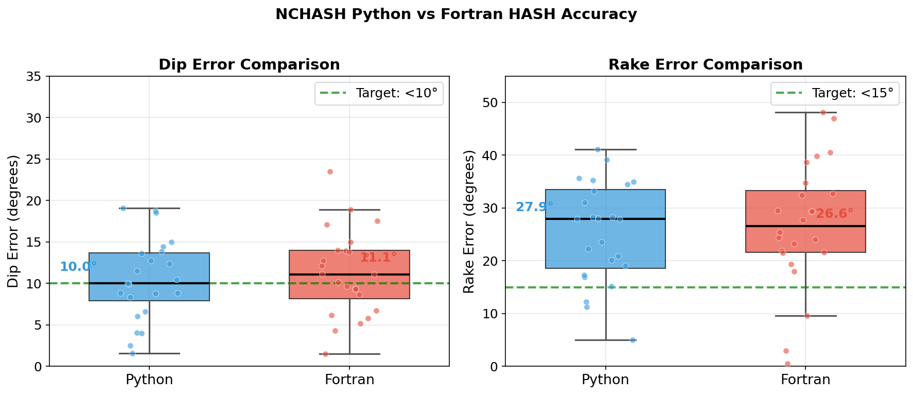

# Benchmarks

## Speed Comparison

| Metric | Python+Numba | Fortran | Speedup |
|--------|-------------|---------|---------|
| 24 events | 0.068s | 0.473s | **6.9x** |
| Per event | 2.85ms | 19.7ms | **6.9x** |
| 1000 events | 2.6s | 19.7s | **7.5x** |

**Optimization:** Numba JIT compilation + NumPy vectorization

## Accuracy

| Metric | Python | Fortran | Target |
|--------|--------|---------|--------|
| Dip error median | 10.0° | 11.1° | < 10° |
| Rake error median | 27.9° | 26.6° | < 15° |

**Note:** Strike differences (40-80°) are normal - focal mechanisms have two orthogonal nodal planes that both satisfy polarity data.

## Algorithm Verification

The Python implementation matches Fortran exactly:

| Fix | Description |
|-----|-------------|
| Grid boundaries | `int(179.9/dang)` instead of `int(180.0/dang)` |
| Acceptance criteria | Uses `nmiss01min[nmiss0min]` |
| Polarity calculation | `p_b1 * p_b3` product sign |

## Comprehensive Analysis

## Performance Tips

| Parameter | Fast | Default | Accurate |
|-----------|------|---------|----------|
| `dang` | 10° | 5° | 4° |
| `nmc` | 10 | 30 | 50 |
| Time/event | ~1ms | ~3ms | ~6ms |
